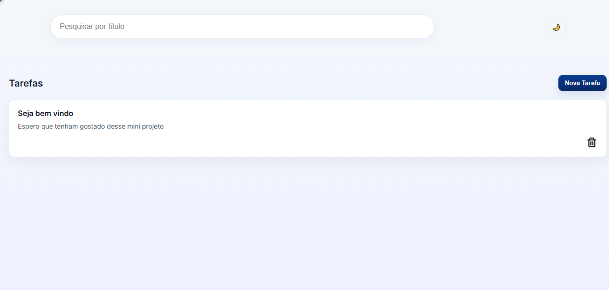
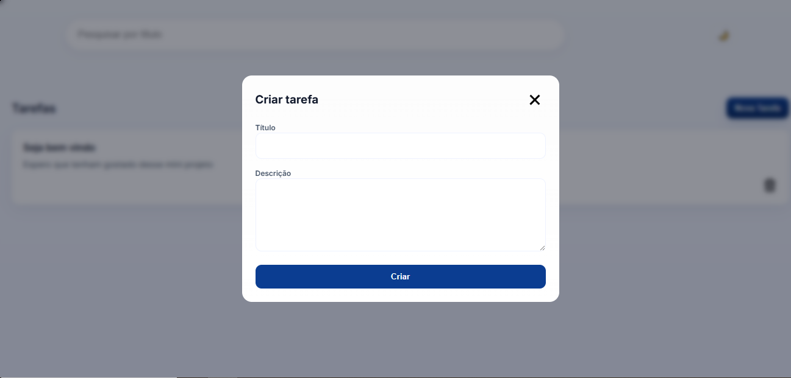

# 📋 Mini Projeto GT

[](./)
[](./)
[](./)
[](./)

> Uma interface limpa e profissional para gestão simples de tarefas — pronta para demonstração.

---

├─ index.html # Marcaçã o principal
├─ style.css # Estilos e tema
├─ script.js # Lógica da aplicação (buscar/criar/deletar)
├─ theme.js # Controle do modo tema/escuro (isolado)
├─ api.json # Dados de exemplo (usado por json-server)
├─ package.json # Metadados do projeto e scripts
├─ package-lock.json # Lock de dependências (gerado pelo npm)
├─ .gitignore # Arquivos/pastas ignorados pelo Git
├─ README.md # Este arquivo
├─ ferramentas/ # scripts e utilitários (opcionais)
└─ assets/
├─ screenshot-desktop.png
└─ screenshot-task.png

Arquivos-chave:

index.html: estrutura da interface.
style.css: tema, responsividade e estilos visuais.
script.js: todas as chamadas fetch e manipulação do DOM — não altere sem testar.

- Interações rápidas: criar, buscar e remover tarefas.
- Estrutura leve e fácil de estender (sem frameworks).

## 🧩 Tecnologias & Competências Demonstradas

- HTML5 semântico
- CSS moderno (variáveis, layout responsivo, sombras sutis)
- `theme.js`: módulo separado que implementa a alternância do tema escuro e persistência (`localStorage`).
- `package.json` / `package-lock.json`: dependências e metadados do projeto (úteis para reproducibilidade e scripts locais).
- `.gitignore`: evita versão de artefatos (ex.: `node_modules/`) no repositório.
- `assets/`: imagens usadas no README e no projeto (ex.: `screenshot-desktop.png`, `screenshot-task.png`).
- JavaScript (fetch, manipulação do DOM, persistência local)
- Boas práticas de UX e responsividade

### 🛠️ Tecnologias (visual)

- 
- 
- 
- 
- 

## ⚙️ Como executar localmente

Instalação rápida para testar com `json-server`:

```bash
# instalar json-server (se ainda não tiver)
npm install -g json-server

# iniciar API local (ex.: api.json)
json-server --watch api.json --port 3000

# abrir index.html no navegador (ou usar Live Server)
```

> Use `npx serve` ou `Live Server` se preferir um servidor estático rápido.

## 🧪 Testes rápidos

- Criar: clique em **Nova Tarefa**, preencha e confirme — a tarefa aparece imediatamente.
- Deletar: use o ícone de lixeira na tarefa.
- Buscar: digite no campo ao topo para filtrar títulos.

## 💻 Estrutura do Projeto

Visão geral dos arquivos e pastas importantes deste repositório:

```text
.
├─ index.html             # Marcaçã o principal
├─ style.css              # Estilos e tema
├─ script.js              # Lógica da aplicação (buscar/criar/deletar)
├─ api.json               # Dados de exemplo (usado por json-server)
├─ README.md              # Este arquivo
├─ ferramentas/           # scripts e utilitários (opcionais)
└─ assets/
   └─ screenshot-desktop.png
   └─screenshot-task.png
```

Arquivos-chave:

- `index.html`: estrutura da interface.
- `style.css`: tema, responsividade e estilos visuais.
- `script.js`: todas as chamadas `fetch` e manipulação do DOM — não altere sem testar.

## 📸 Screenshots

Imagens do projeto (colocadas na pasta `assets`):

- **Página inicial (Desktop)**

    
  Descrição: Exibe a página inicial do projeto com o layout principal — cabeçalho, campo de busca e botões de ação.

- **Fluxo — Criar Tarefa (screenshot-task)**

    
  Descrição: Mostra a interface de criar uma nova tarefa (modal/form) e a tarefa recém-criada aparecendo na lista.

## 🤝 Contribuições

Pull requests e sugestões são bem-vindas — abra uma issue ou envie PR com melhorias.

## 📜 Licença

MIT — sinta-se à vontade para reutilizar e adaptar.

---

## 👤 Autor

[](mailto:luarvb12@gmail.com)
[](mailto:luarvb12@gmail.com)
[](https://www.linkedin.com/in/luã-rafael-1434213a3/)
